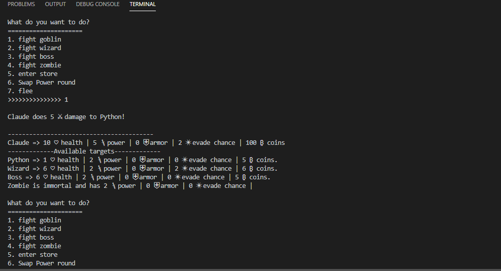

# Python rpgGame

- App can only run in the console at the moment

## What it is

- The project is built using classes of heroes and villans and the game logic is made through randomization and calculations, based on each characters specifics.

- Through this project I got a deeper understanding on what Object-Oriented Programming is and how to use and reuse classes and objects.



# Technologies and tools used:
- Python 3
- Object-Oriented Programming


### Some interesting functions used:

- Each hero/villan has own methods that  makes them unique

- Example of child class of the Character class

```python
class Hero(Character):
    def __init__(self, name, health, power,armor,evade, bounty):
        super(Hero,self).__init__(name, health, power,armor,evade, bounty)
        # considers armor and if solves case when target.armor > self.power wich would add HP if not
    def attack(self, target):
        if self.evadeChance(target) == True:
            print(f"{target.name} evaded the attack.")
            return
        roll = random.randint(1,10)     #roll for hero 20% chance of Double Damage
        heroAttack = self.power - target.armor
        if roll in range (1,9):
            if heroAttack > 0:
                target.health -= heroAttack
                print(f"\n{self.name} does {heroAttack} ⚔ damage to {target.name}!")
            else:
                print(f"{target.name}'s armor blocked all damage.")
        else:
            if heroAttack > 0:
                target.health -= heroAttack*2
                print(f"\n{self.name} does {heroAttack*2} ⚔ Double Damage to {target.name}!")
            else:
                print(f"{target.name}'s armor blocked all damage.")
```
- Part of the "fight" function that randomizes the attack(depending on each characters attributes)

```python
ef fight(pickedHero,villan):
    if pickedHero.alive() and villan.alive():
        # roll 50 50 chance for hero or villan to attack
        roll = random.randint(1,100)
        # hero attacks
        if roll <= 50:
            pickedHero.attack(villan)
            pickedHero.takeCoins(villan)
        else:
        # villan attacks
```
- As a future project I will make the game playable inside a web page
